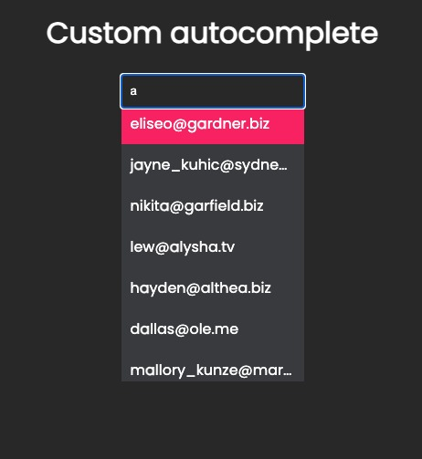

# 🚀 Front end code challenge


## How to run the project locally
To run the application simply enter in the cloned folder, install the dependencies (pnpm is recommended) but not required and after that just run pnpm dev and you're all set.
```
pnpm install
pnpm dev
```


#### You can improve the performance of this autocomplete component with virtualization, but for tests purpose was not needed.

---